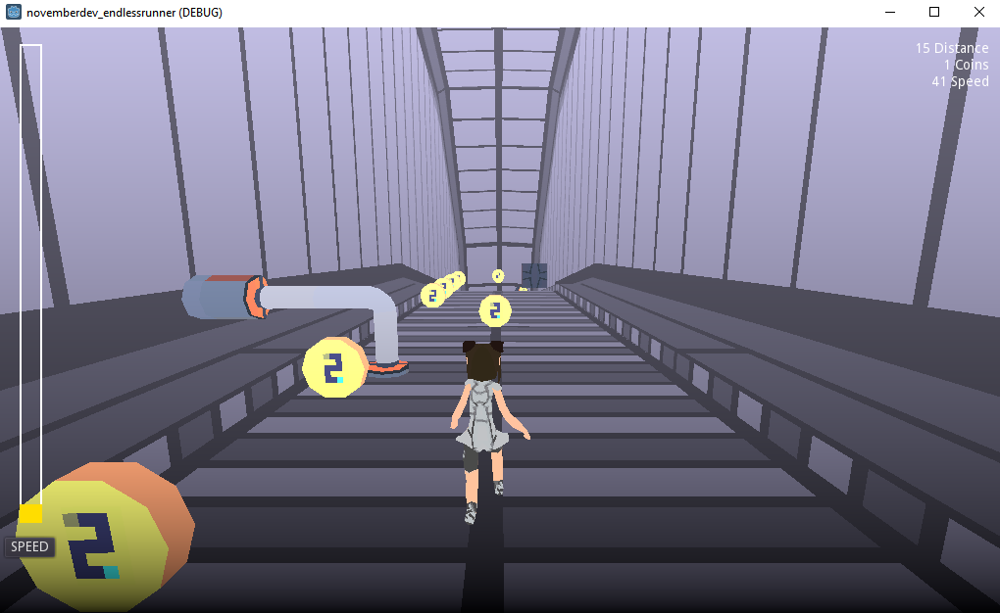
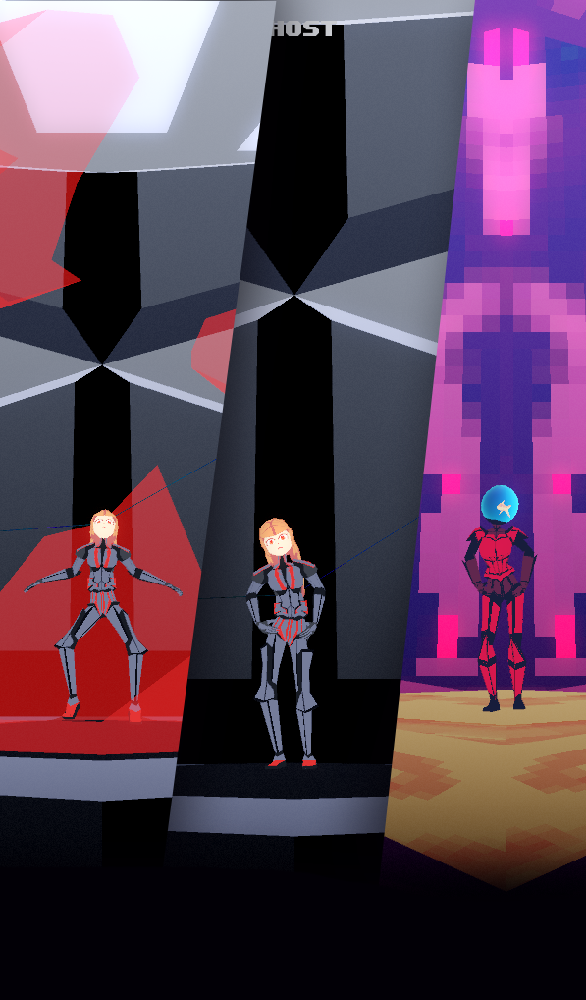
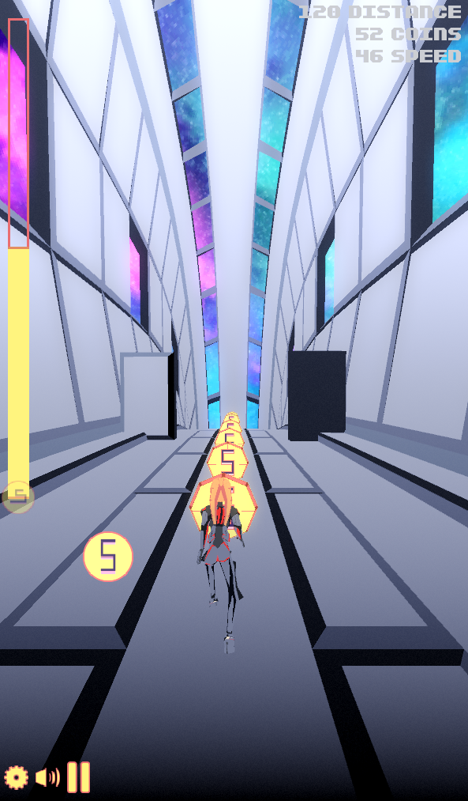
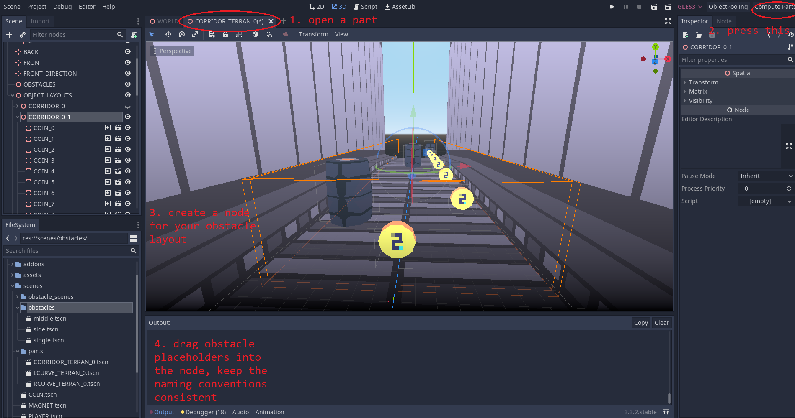

# Endless-Runner Template and Tutorial by NovemberDev
 
 
 This is an endless runner template I built for a video 
 and a game (Nov Run) that I released on the Google Play Store.

 ## Screenshot


## Screenshots of Nov Run (final game)



## How does it work?

Nov Run is mainly controlled by World.gd.
The script spawns Parts (Corridor, Curves) and
populates them with obstacles (obstacles, obstacle_scenes).

Foreach part in scenes/parts, you open a part and click on
the toolscript "Compile Parts", which spawns an OBJECT_LAYOUTS node, where you can drag in Scenes from scenes/obstacles.



If you press the "Compile Parts"-Button again, the Toolscript
creates a "res://compiled_parts.tres"-File, which contains your configuration and gets parsed at runtime foreach part of any theme.

In the background another Toolscript (ObjectPooling.gd) creates instances of your scenes to make sure the game doesn't stutter while you play.

## How to extend the game?

1. Clone the Project and open it in Godot 3
2. Create 3D models for obstacle_scenes with the ORIENTATION_THEME_INDEX naming convention
3. Create 3D models for parts with the ORIENTATION_THEME_INDEX naming convention
4. Register new themes in World.gd:
```
var themes = ["TERRAN"]
var themes = ["TERRAN", "EGYPT"]
```

## Nov Run on Google Play 

https://play.google.com/store/apps/details?id=com.novemberdev.novemberdevnovrun

Note: this game is still a technical test, just with more assets now